<div align="center">


# Crucible — Online Coding Judge

**A competitive-programming judge that compiles, sandboxes and grades untrusted code.**

Submit in Python, C++ or Java and poll for an asynchronous verdict — graded
against sample and hidden test suites inside an isolated sandbox with hard time,
memory, CPU and process limits.

[](https://github.com/dhanoliya-ji/ONLINE-CODING-JUDGE/actions/workflows/ci.yml)
[](https://www.python.org/)
[](https://fastapi.tiangolo.com/)
[](https://react.dev/)
[](https://www.postgresql.org/)
[](https://www.docker.com/)
[](#-testing)
[](LICENSE)

### **[▶ Open the live demo](https://crucible-web.onrender.com)**

[Screenshots](#-screenshots) · [Quick start](#-quick-start) · [Architecture](docs/ARCHITECTURE.md) ·
[API reference](docs/API.md) · [Security](docs/SECURITY.md) · [Deployment](docs/DEPLOYMENT.md)

</div>

---

## 🌐 Live demo

| Service | URL | Notes |
|---|---|---|
| **Web app** | **<https://crucible-web.onrender.com>** | Static site on a CDN — never sleeps |
| API | <https://online-coding-judge-7w5q.onrender.com> | Free web service — sleeps when idle |
| Swagger UI | <https://online-coding-judge-7w5q.onrender.com/docs> | Interactive, try any endpoint |
| ReDoc | <https://online-coding-judge-7w5q.onrender.com/redoc> | Reference-style API docs |
| OpenAPI schema | <https://online-coding-judge-7w5q.onrender.com/openapi.json> | Machine-readable |
| Health / sandbox report | <https://online-coding-judge-7w5q.onrender.com/api/v1/health> | What this instance is really running |

**Demo account** — `demo@example.com` / `DemoPass123`
(the sign-in page has a one-click button for it)

> ⏱️ **First request may take 40–60 seconds.** Render spins an idle free *web
> service* down after ~15 minutes. The frontend is static and always loads
> instantly; it detects the wait and shows a **"waking the judge…"** banner
> rather than appearing broken. Every request after the first is fast.

> 🔒 **The live demo does not use container isolation.** Free hosting exposes no
> Docker socket, so the deployment runs the `rlimit` subprocess sandbox instead.
> The `/api/v1/health` endpoint always reports which backend is actually active
> — this project never claims isolation it is not providing. Run
> `docker compose up` locally for the real container sandbox. See
> [Security](docs/SECURITY.md).

---

## 📸 Screenshots

> Every image below is **generated by [`scripts/capture_screenshots.mjs`](scripts/capture_screenshots.mjs)**
> driving a real browser against a running instance — and every verdict shown was
> produced by genuinely submitting that code to the judge. Nothing is mocked or
> staged. See [docs/screenshots/](docs/screenshots/README.md).

### Solving a problem

The statement sits beside a real editor with per-language syntax modes. **Run**
executes against custom input; **Submit** judges against the whole suite.

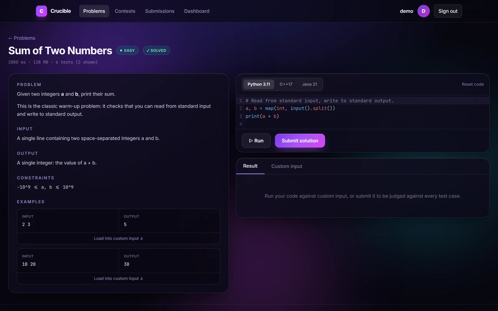

### Verdicts

A correct solution — 6 of 6 tests, with the time and memory the sandbox measured:

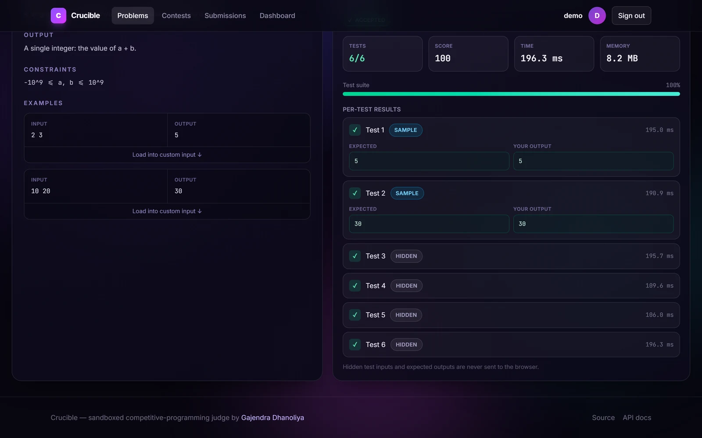

A wrong one — the failing test index, plus expected-vs-actual for the **sample**
case. Hidden test data is never sent to the browser:


<table>
<tr>
<td width="50%">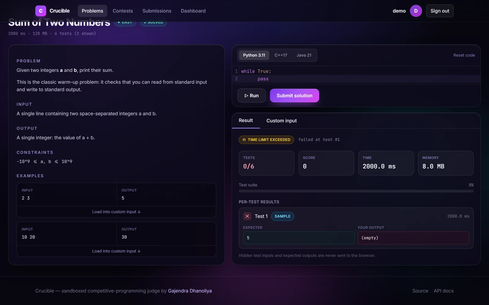<br><em>Time Limit Exceeded — the wall clock firing</em></td>
<td width="50%">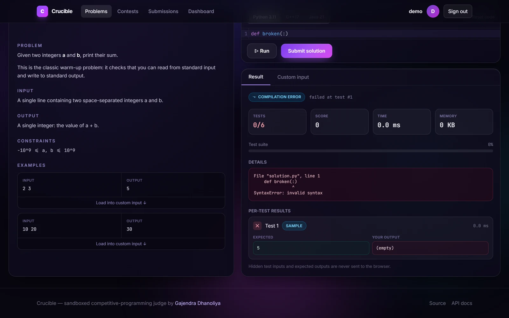<br><em>Compilation Error — real compiler diagnostics</em></td>
</tr>
</table>

### Problems, contests and standings

<table>
<tr>
<td width="50%">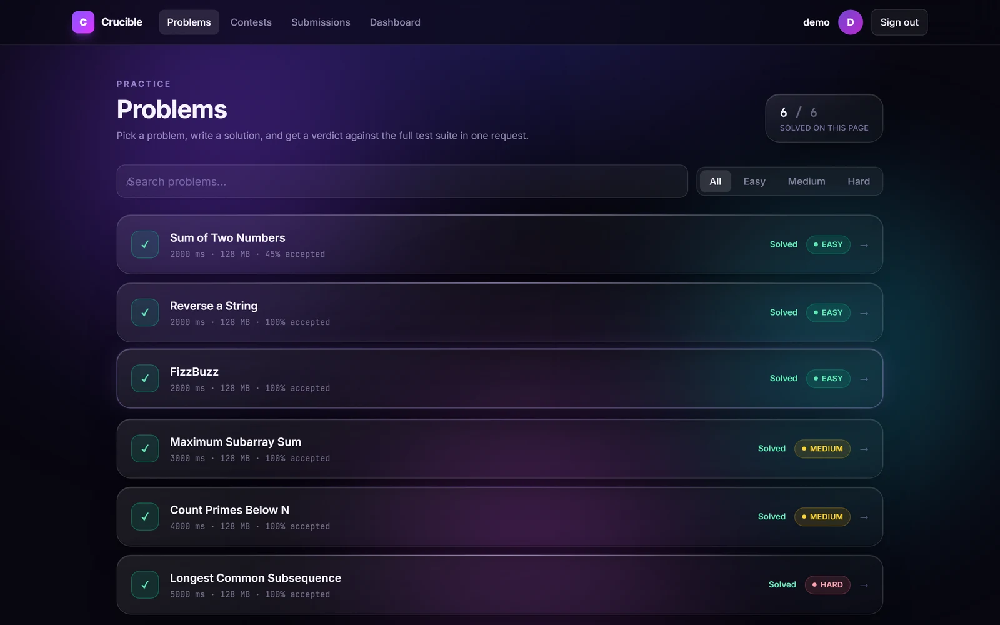<br><em>Catalogue with filters and solved markers</em></td>
<td width="50%">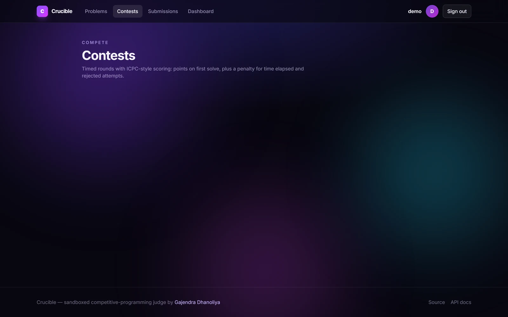<br><em>Contests with a live countdown</em></td>
</tr>
</table>

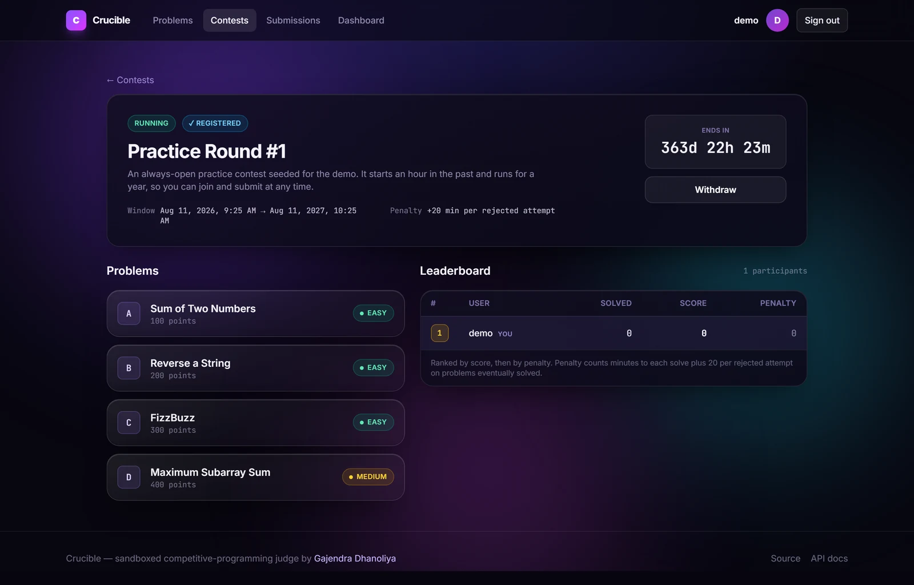

### Analytics

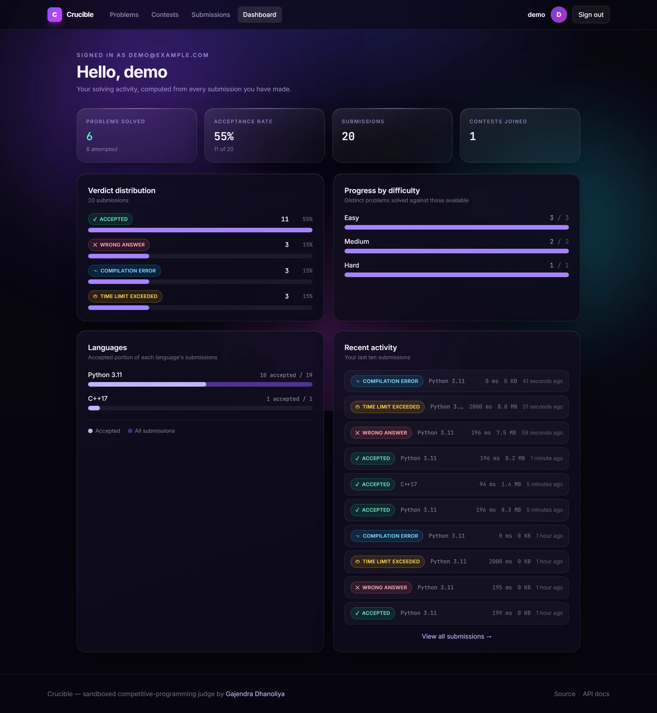

### Also included

<table>
<tr>
<td width="33%">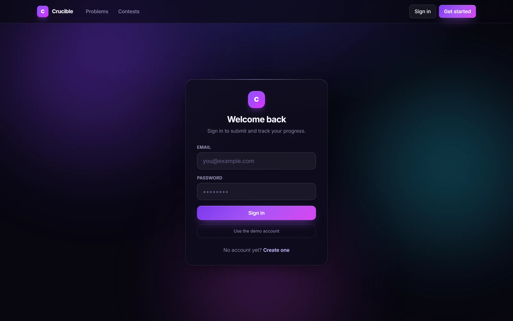<br><em>Sign in</em></td>
<td width="33%">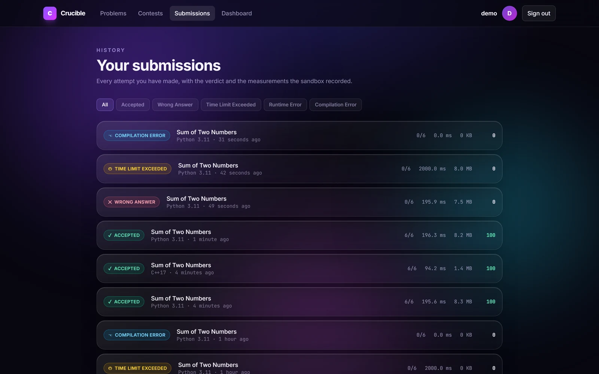<br><em>Submission history</em></td>
<td width="33%">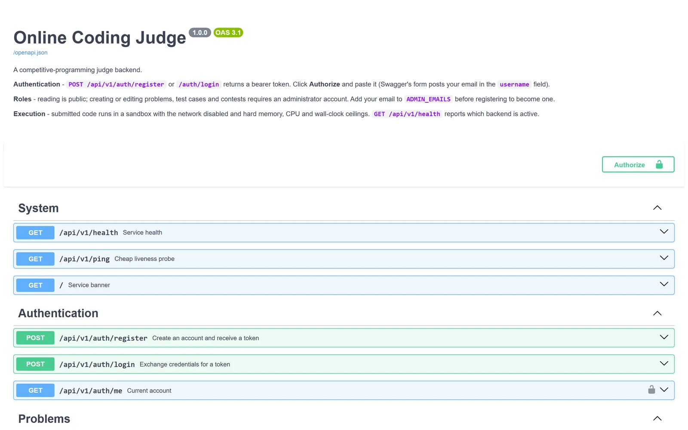<br><em>Generated API docs</em></td>
</tr>
</table>

<div align="center">
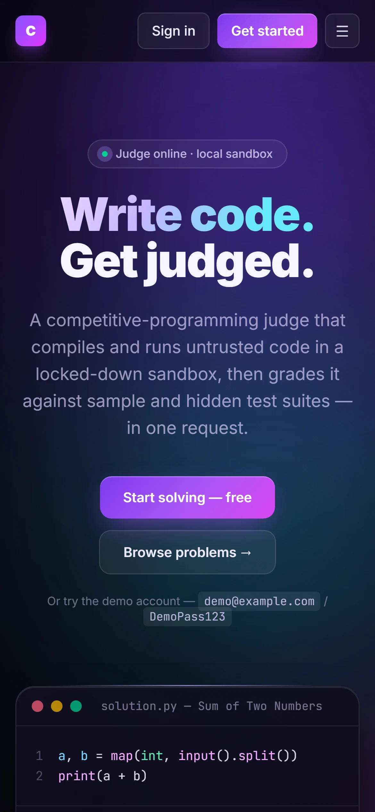
<br><em>Responsive down to 390 px</em>
</div>

---

## 💡 Why this project is interesting

Running code a stranger wrote, on your server, and returning a trustworthy
verdict is the whole problem. Nearly everything here follows from that:

- **Untrusted code must not escape.** Every submission executes with the network
  disabled, a hard memory ceiling, a CPU quota, a process cap, a read-only root
  filesystem, all Linux capabilities dropped, and a wall-clock timeout enforced
  from *outside* the sandbox.
- **A verdict must be reproducible.** Output comparison normalises trailing
  whitespace and line endings, so a stray newline never fails a correct solution
  and a whitespace trick never passes a wrong one.
- **The answer key must stay secret.** Hidden test data is never serialised into
  any response. Sample cases are diffed back because that data was already
  public on the problem page.
- **Contest scoring must be hard to game.** Points are awarded once per problem
  on first solve, only for submissions scoped to the contest and made inside its
  window, with an ICPC-style time-plus-attempt penalty.

The execution engine is **pluggable** — a `SandboxBackend` interface with a
Docker implementation and an rlimit-subprocess implementation, selected at
startup. That is what lets the same codebase provide genuine container isolation
locally and still deploy to a free host that forbids it.

📖 **[Read the full architecture →](docs/ARCHITECTURE.md)**

---

## ✨ Features

<table>
<tr><td width="50%" valign="top">

**Authentication & authorisation**
- Registration and login issuing JWTs
- bcrypt password hashing (cost 12)
- Role-based access control: admin vs user
- Timing-equalised login (no user enumeration)
- Password strength rules, bcrypt 72-byte guard
- Swagger **Authorize** integration

**Problems**
- Full CRUD, admin-gated
- Slug URLs (`/problems/sum-of-two-numbers`)
- Search, difficulty filter, pagination
- Per-problem time and memory limits
- Draft/published visibility
- Per-user `solved` / `attempted` markers

**Test cases**
- Sample and hidden suites
- Bulk upload with optional replace
- **Hidden data never leaves the server**
- Samples judged first, so failures are cheap

</td><td width="50%" valign="top">

**Submissions & judging**
- Python 3.11, C++17 (GCC), Java 21
- Seven verdicts incl. Compilation Error and MLE
- Real execution time and peak memory
- Per-test breakdown; diffs for samples only
- Celery + Redis asynchronous submission judging
- `POST /submissions/run` for scratch runs
- Source code private to its author
- Filterable history

**Contests**
- CRUD, registration, withdrawal
- Derived state: Upcoming / Running / Ended
- Problems sealed until the contest starts
- Window and registration enforced on submit
- Labels (A, B, C…) and per-problem points
- Leaderboard with ICPC penalty, tie-aware ranks

**Frontend & operations**
- React 19 + TypeScript, glassmorphic UI
- CodeMirror 6 editor, drafts persisted locally
- Cold-start detection and messaging
- `/health` reporting DB and sandbox status
- Automated pytest suite, GitHub Actions CI
- Reproducible, script-generated screenshots

</td></tr>
</table>

---

## 🏗 How it fits together

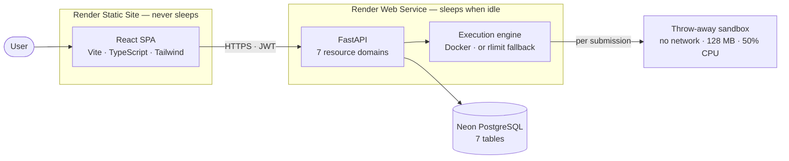

📖 **[Full architecture, request lifecycle and judging pipeline →](docs/ARCHITECTURE.md)**

---

## 🛠 Tech stack

| Layer | Choice | Why |
|---|---|---|
| Frontend | React 19 + TypeScript + Vite | Typed against the same shapes the API returns; sub-second builds |
| Styling | Tailwind CSS v4 | CSS-first config, so tokens live beside the glass primitives using them |
| Editor | CodeMirror 6 | Bundles with Vite instead of loading from a CDN, so it works on any network |
| API | FastAPI 0.116 | Type-driven validation, with OpenAPI generated from the same annotations |
| Language | Python 3.11 | `X \| Y` unions, `StrEnum`, better tracebacks |
| ORM | SQLAlchemy 2.0 | Typed `Mapped[...]` models, modern `select()` API |
| Database | PostgreSQL 16+ (Neon) | Real constraints and aggregates; SQLite for zero-setup dev |
| Auth | python-jose + bcrypt | Standard bearer tokens; bcrypt called directly, not via passlib |
| Sandbox | Docker SDK, POSIX rlimits | Container isolation, with a documented fallback |
| Tests | pytest + httpx | Full-stack tests over real HTTP, no external services |
| CI/CD | GitHub Actions | Tests, seed verification and an image build on every push |
| Hosting | Render + Neon | Both have genuinely free tiers |

---

## 🚀 Quick start

The fastest path — **SQLite, no database server, no Docker**:

```bash
git clone https://github.com/dhanoliya-ji/ONLINE-CODING-JUDGE.git
cd ONLINE-CODING-JUDGE

python -m venv venv
venv\Scripts\activate            # Windows
# source venv/bin/activate       # macOS / Linux

pip install -r requirements.txt
copy .env.example .env           # cp on macOS / Linux

python -m scripts.seed --reset   # 6 problems, 1 contest, 2 accounts
uvicorn app.main:app --reload
```

API is now on <http://localhost:8000> with docs at `/docs`. In a second terminal:

```bash
cd frontend
npm install
npm run dev                      # http://localhost:5173
```

That's the whole app running locally against SQLite.

📖 **[Docker Compose, Postgres, seeding and troubleshooting →](docs/DEVELOPMENT.md)**

---

## 📖 Documentation

This README is the overview. The detail lives in `docs/`:

| Document | What it covers |
|---|---|
| **[Architecture](docs/ARCHITECTURE.md)** | Layers, request lifecycle, judging pipeline, data model, indexes, design decisions and the trade-offs behind them |
| **[API reference](docs/API.md)** | Every endpoint, parameters, request/response bodies, status codes, error shapes, and worked `curl` examples |
| **[Security](docs/SECURITY.md)** | The sandbox in full, the threat model, what the fallback backend does *not* protect, auth, RBAC, and known limitations |
| **[Deployment](docs/DEPLOYMENT.md)** | Neon setup, Render blueprint, environment variables, self-hosting with the real Docker sandbox, troubleshooting |
| **[Development](docs/DEVELOPMENT.md)** | Local setup in three modes, project layout, testing, seeding, screenshot regeneration, contributing |
| **[Frontend](frontend/README.md)** | Design system, component structure, state, routing, build and the glassmorphism decisions |
| **[Screenshots](docs/screenshots/README.md)** | How the images are generated and how to regenerate them |

---

## ⚖️ Verdict reference

| Verdict | Meaning | Trigger |
|---|---|---|
| **Accepted** | Every test passed | All outputs matched after normalisation |
| **Wrong Answer** | Output differs | Normalised comparison failed |
| **Time Limit Exceeded** | Too slow | Wall clock exceeded the problem's limit |
| **Memory Limit Exceeded** | Too much memory | Container OOM kill, or `RLIMIT_AS` hit |
| **Runtime Error** | Crashed | Non-zero exit: exception, segfault, bad exit code |
| **Compilation Error** | Would not build | `g++`/`javac` failed, or Python failed `py_compile` |
| **Output Limit Exceeded** | Printed too much | Beyond `EXECUTION_MAX_OUTPUT_BYTES` |
| **Internal Error** | The judge failed | Sandbox unavailable, or a problem with no test cases |

---

## 🧪 Testing

```bash
pytest                       # all tests
pytest -v                    # verbose
pytest tests/test_judging.py # one module
pytest -k leaderboard        # by name
```

The suite runs on SQLite with the local backend — no Postgres, no Docker. Each
test gets a freshly created and dropped schema.

| Module | Tests | Covers |
|---|---|---|
| `test_auth.py` | 7 | Registration, duplicates, weak passwords, case-insensitive email, enumeration resistance |
| `test_problems.py` | 7 | RBAC, pagination, filters, slug lookup, draft visibility, PATCH semantics |
| `test_test_cases.py` | 8 | **Hidden data redaction**, admin access, bulk upload, cascade delete |
| `test_judging.py` | 18 | All five reachable verdicts, scoring, redaction, source privacy, output normalisation |
| `test_contests.py` | 17 | Window validation, state derivation, registration, **leaderboard scoring rules** |
| `test_dashboard.py` | 5 | Aggregates, division-by-zero, per-caller scoping |
| `test_execution_backend.py` | 12 | **A backend must never raise**, stdout/stderr separation, limits, secret scrubbing |
| `test_packaging.py` | 12 | Encoding guards on files that non-Python tooling has to read |
| `test_health.py` | 5 | Health payload, OpenAPI generation, timing header |
| `test_async_submissions.py` | 9 | Async submission flow, status transitions, duplicate claims |
| `test_phase1_security.py` | 5 | Rate limiting, CORS credentials, unsafe execution safety flags |
| `test_phase2_async.py` | 4 | Celery async worker judging tasks |
| `test_docker_socket_remediation.py` | 4 | Worker offloading for run requests, timeout/error responses |

Seed data has its own guard: `scripts/verify_seed.py` judges a known-correct
solution against every bundled problem, so a wrong expected output is caught in
CI rather than by a confused user.

---

## ⚠️ Known limitations

Stated plainly, because a judge that overstates its isolation is worse than one
that documents its edges.

1. **The free live demo does not use container isolation.** It runs the `local`
   rlimit backend, which has no network or filesystem namespace. Treat the
   hosted demo as a functional showcase, not a hardened service.
2. **Java is unavailable on the hosted demo.** Render's native Python runtime
   has no JDK, so Java submissions return a clear "toolchain is not installed"
   error rather than a misleading verdict. All three languages work locally
   under `docker compose up`.
3. **Worker crash recovery is still operational.** Duplicate queue deliveries
   are guarded by status transitions, but a process crash after claiming a row
   can leave a submission in `Running` until an operator requeues or marks it.
4. **`create_all()` is not a migration system.** New tables appear; changed
   columns do not.
5. **Rate limiting active.** Per-route rate limiting is enforced via `slowapi` for submissions, scratch runs, and authentication.
6. **The Docker backend is unverified on Windows hosts.** It is written against
   Linux container semantics; Docker Desktop runs a Linux VM so it should work,
   but CI only exercises the local backend.

📖 **[Full threat model and what the fallback does not protect →](docs/SECURITY.md)**

---

## 🗺 Roadmap

- [x] **Celery + Redis queue** — asynchronous judging with a status poll
- [ ] **WebSocket live verdicts** — per-test progress as it happens
- [x] **Rate limiting** — per-user submission throttle
- [ ] **Alembic migrations** — once the schema must change under real data
- [x] **Dedicated judge workers** — isolate execution from the credential-holding host
- [ ] **More languages** — Go, Rust, JavaScript (one `LanguageSpec` each)
- [ ] **Special judges** — checker programs for problems with multiple valid answers
- [ ] **Rejudge** — re-run a problem's submissions after a test-suite fix
- [ ] **Editorials and problem tags**
- [ ] **Plagiarism detection** — MOSS-style similarity over accepted solutions

---

## 👨‍💻 Author

**Gajendra Dhanoliya**

- GitHub — [@dhanoliya-ji](https://github.com/dhanoliya-ji)
- LinkedIn — [Gajendra Dhanoliya](https://www.linkedin.com/in/gajendradhanoliya-dhanoliya-813345359/)

## 📄 License

Released under the [MIT License](LICENSE).

---

<div align="center">

**[▶ Try the live demo](https://crucible-web.onrender.com)** · If this is useful to you, a ⭐ is appreciated.

</div>
