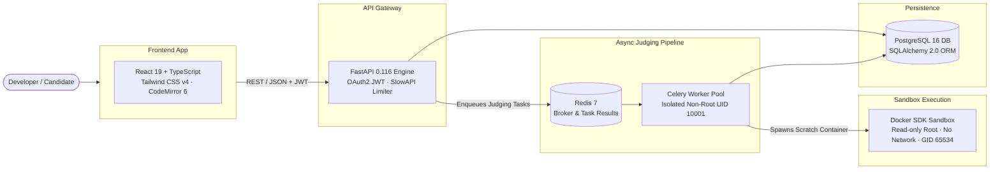
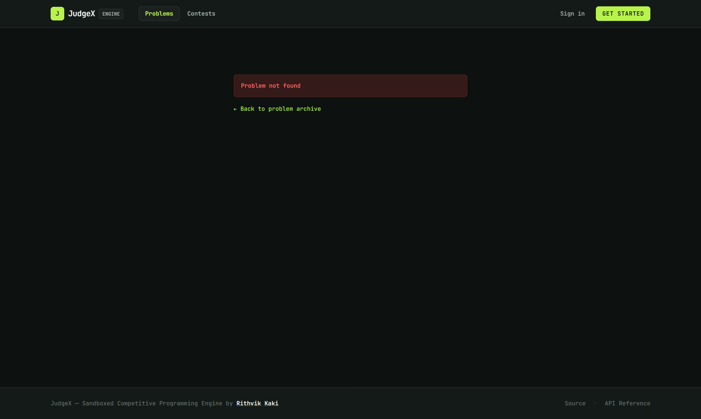
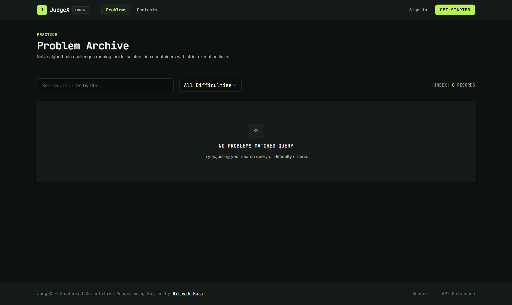
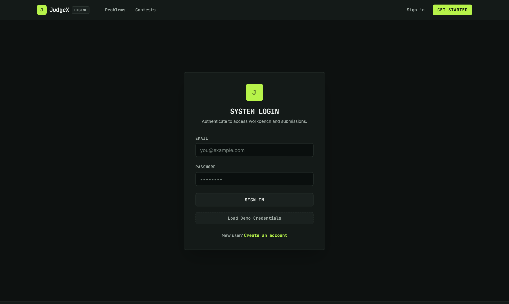

# JudgeX — Online Coding Judge & Execution Engine

**A modern, production-grade competitive programming judge that compiles, sandboxes, and evaluates untrusted code with containerized isolation.**

JudgeX allows developers and competitive programmers to submit code in **Python 3.11**, **C++17 (GCC)**, or **Java 21**, executing submissions against test suites inside an isolated sandbox with strict resource limits (Time, Memory, CPU, Process count, and Network isolation).

---

## 📌 Table of Contents

- [Project Overview](#-project-overview)
- [Key Features](#-key-features)
- [Architecture](#-architecture)
- [Tech Stack](#-tech-stack)
- [Security Model & Sandboxing](#-security-model--sandboxing)
- [Project Screenshots](#-project-screenshots)
- [Getting Started](#-getting-started)
- [Running with Docker](#-running-with-docker)
- [API Overview](#-api-overview)
- [Future Improvements](#-future-improvements)

---

## 🎯 Project Overview

JudgeX is built to solve the core engineering challenge of competitive programming platforms: **safe, fast, and accurate execution of untrusted user code on server infrastructure**.

- **High-Performance Judging Pipeline**: Asynchronous submission processing using Celery workers backed by Redis queues.
- **Pluggable Sandbox Engine**: Switch seamlessly between a hardened Docker container backend and a POSIX `rlimit` process sandbox.
- **Swiss Engineering Design System**: Built with a dark Graphite + Electric Lime theme optimized for developer focus and technical precision.
- **Comprehensive Platform**: Features problem archives, contest management with ICPC-style scoring, submission analytics, and detailed verdict telemetry.

---

## ✨ Key Features

- **Multi-Language Execution**: Support for Python 3.11, C++17, and Java 21 with precise execution timing and memory metrics.
- **7 Detailed Verdict Outcomes**: Accepted (`AC`), Wrong Answer (`WA`), Time Limit Exceeded (`TLE`), Memory Limit Exceeded (`MLE`), Runtime Error (`RTE`), Compilation Error (`CE`), and Output Limit Exceeded (`OLE`).
- **Asynchronous Task Queue**: Celery + Redis judging pipeline prevents web worker blocking during peak load.
- **Contest Engine & Standings**: Real-time ICPC penalty calculations, tie-aware ranking, submission timing validation, and sealed problem statements.
- **Developer Workstation UI**: Split-pane problem workbench with CodeMirror 6, custom input execution (`Run Custom`), and responsive mobile workspace navigation (`[PROBLEM] [CODE] [OUTPUT]`).
- **Role-Based Access Control**: Admin authorization for problem creation, test case bulk management, and contest configuration.

---

## 🏗 Architecture



---

## 🛠 Tech Stack

| Layer | Technology | Rationale |
|---|---|---|
| **Frontend** | React 19 + TypeScript + Vite | Type-safe UI components, sub-second HMR, optimized production chunks. |
| **Styling** | Tailwind CSS v4 | Graphite + Electric Lime developer token system using native `@theme`. |
| **Code Editor** | CodeMirror 6 | Embedded syntax modes for Python, C++, Java with local draft retention. |
| **Backend API** | FastAPI 0.116 + Pydantic v2 | High-concurrency async Python framework with automatic OpenAPI schemas. |
| **Database** | PostgreSQL 16 / SQLite | SQLAlchemy 2.0 ORM with typed mappings; SQLite fallback for zero-setup dev. |
| **Task Queue** | Celery 5 + Redis 7 | Asynchronous, non-blocking submission judging pipeline. |
| **Sandbox Engine** | Docker SDK & POSIX `rlimits` | Isolated throwaway container execution with process namespace isolation. |
| **Testing Suite** | Pytest 8 + HTTPX | Full backend integration test coverage (111 passing tests). |

---

## 🔒 Security Model & Sandboxing

Executing untrusted code requires defense in depth across multiple layers:

1. **Non-Root Execution**: Worker processes run under unprivileged UID `10001`. Sandbox containers execute under UID/GID `65534` (`nobody`).
2. **Network Isolation**: All submission containers run with `--net=none`, blocking outbound network access and data exfiltration attempts.
3. **Resource Caps**:
   - Wall-clock & CPU time limits (default 2000 ms).
   - Memory allocation ceiling (default 128 MB).
   - Process count limits (`PIDs=64`) to prevent fork bombs.
   - Max output limit (`64 KB`) to prevent runaway stdout logging.
4. **File System Security**: Scratch workdirs are created atomically with `mkdtemp` and permissions restricted to `0750` / `0770` with group `65534`. Root filesystem is read-only.
5. **API & Socket Isolation**: The web API container has **NO access** to the Docker socket; only the dedicated judging worker interacts with the Docker engine.

---

## 📸 Project Screenshots

### 1. Developer Workstation & Problem Workbench
Split-pane interface featuring problem statement, CodeMirror syntax editor, and custom test input runner.


### 2. Live Judging Verdict Telemetry
Real-time verdict feedback with precise execution time (ms) and peak memory (MB) metrics.



### 3. Technical Problem Archive
Filterable problem catalogue with difficulty indicators and user completion tracking.



### 4. Telemetry & User Dashboard
Personal activity breakdown, verdict distribution, and contest participation history.



---

## 🚀 Getting Started

### Prerequisites
- Python 3.11+
- Node.js 18+
- Docker Desktop (optional for local container sandboxing)

### Quick Start (Local Process Sandbox)

1. **Clone the repository**:
   ```bash
   git clone https://github.com/rithvikkaki/JudgeX.git
   cd JudgeX
   ```

2. **Setup Backend**:
   ```bash
   python -m venv venv
   # On Windows:
   venv\Scripts\activate
   # On macOS/Linux:
   # source venv/bin/activate

   pip install -r requirements.txt
   cp .env.example .env

   # Seed database with initial problems & contests
   python -m scripts.seed --reset

   # Start FastAPI server
   uvicorn app.main:app --reload
   ```

3. **Setup Frontend**:
   ```bash
   cd frontend
   npm install
   npm run dev
   ```
   Open `http://localhost:5173` in your browser.

---

## 🐳 Running with Docker

To run the complete production-like stack (PostgreSQL, Redis, API, Celery Worker, and Docker Sandbox Engine):

```bash
# Build and launch all container services
docker compose up --build -d

# Seed the Postgres database inside the container
docker compose exec api python -m scripts.seed
```

Access services:
- **Frontend App**: `http://localhost:5173` (or `http://localhost:5175`)
- **API Server**: `http://localhost:8000`
- **Swagger Documentation**: `http://localhost:8000/docs`

---

## 📡 API Overview

JudgeX provides a clean RESTful API with automated OpenAPI / Swagger documentation:

| Endpoint | Method | Description |
|---|---|---|
| `/api/v1/auth/register` | `POST` | Create a new user account and receive JWT access token. |
| `/api/v1/auth/login` | `POST` | Authenticate and obtain JWT access token. |
| `/api/v1/problems/` | `GET` | List problem archive with search, difficulty, and pagination filters. |
| `/api/v1/problems/{slug}` | `GET` | Retrieve problem specification and sample test cases. |
| `/api/v1/submissions/` | `POST` | Submit solution for asynchronous judging. |
| `/api/v1/submissions/{id}` | `GET` | Poll submission status, verdict, execution time, and memory usage. |
| `/api/v1/submissions/run` | `POST` | Execute scratch code against custom stdin without storing a submission. |
| `/api/v1/contests/` | `GET` | List upcoming, active, and past contests. |
| `/api/v1/contests/{id}/standings` | `GET` | Fetch real-time ICPC contest standings matrix. |
| `/api/v1/health` | `GET` | Inspect system health, database latency, and active execution backend. |

---

## 🗺 Future Improvements

- [ ] **WebSocket Live Telemetry**: Streaming per-testcase execution feedback as it processes.
- [ ] **Expanded Language Runtimes**: Adding Go, Rust, and JavaScript (Node.js) execution specs.
- [ ] **Interactive Plagiarism Detection**: MOSS-style AST code similarity analysis across contest submissions.
- [ ] **Alembic Database Migrations**: Automated schema version tracking for production evolution.

---

## 👨‍💻 Author & License

Developed by **Rithvik Kaki** ([@rithvikkaki](https://github.com/rithvikkaki)).  
Released under the [MIT License](LICENSE).
