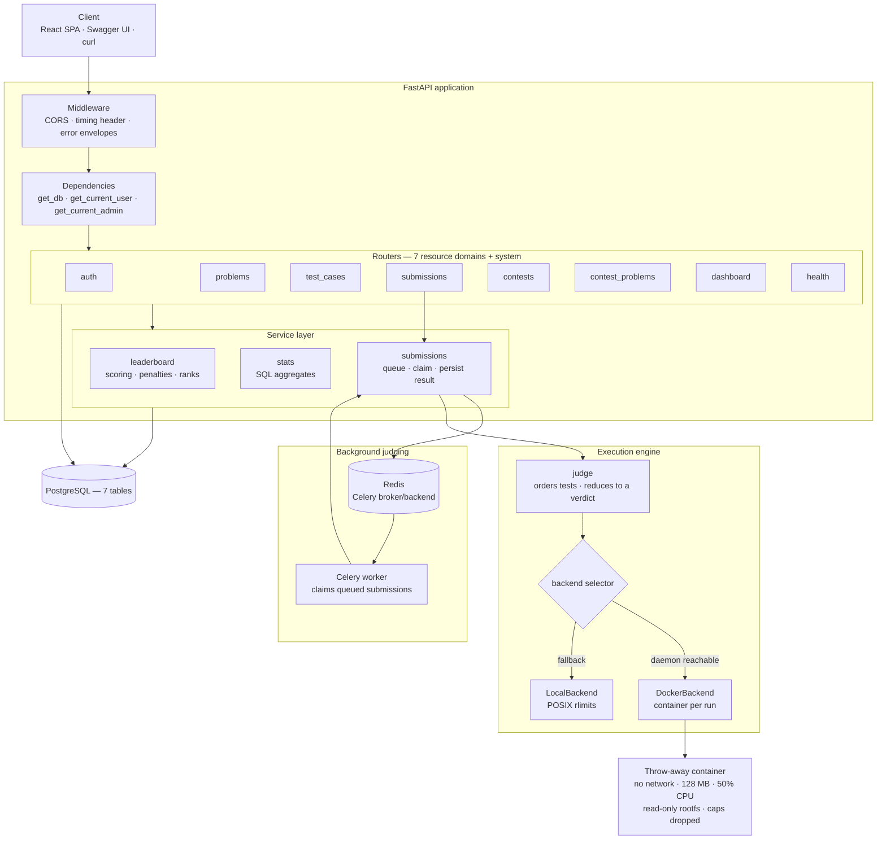
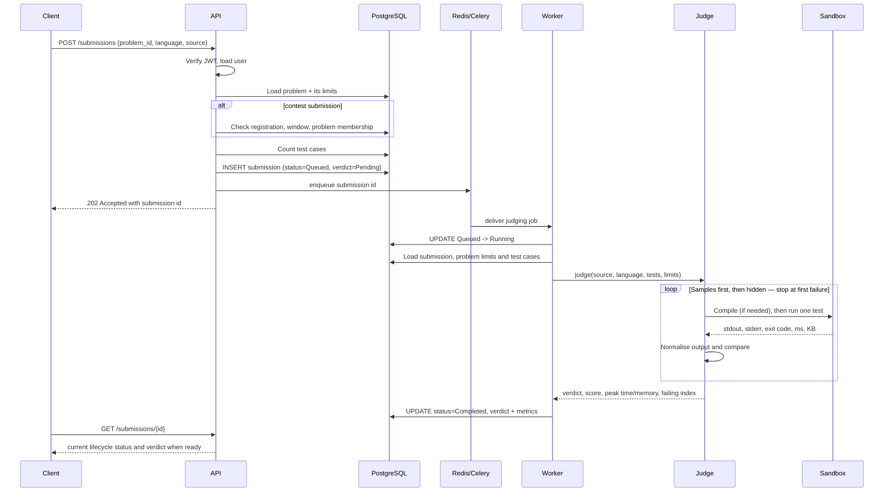
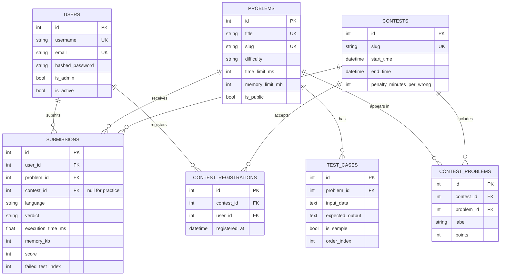

# Architecture

How JudgeX is put together, and why each piece is shaped the way it is.

- [System overview](#system-overview)
- [Layers](#layers)
- [Request lifecycle](#request-lifecycle)
- [The judging pipeline](#the-judging-pipeline)
- [The execution engine](#the-execution-engine)
- [Data model](#data-model)
- [Contest scoring](#contest-scoring)
- [Frontend architecture](#frontend-architecture)
- [Design decisions](#design-decisions)
- [What was rebuilt and why](#what-was-rebuilt-and-why)

---

## System overview



The shape is deliberately boring: a thin HTTP layer, a thin service layer for
the two pieces of logic too involved for a handler, and one genuinely
interesting subsystem — the execution engine.

---

## Layers

| Layer | Directory | Responsibility | Rule |
|---|---|---|---|
| **Routes** | `app/routes/` | HTTP shape: parse, authorise, delegate, serialise | No business logic beyond guard clauses |
| **Schemas** | `app/schemas/` | Request/response contracts, validation | Pydantic only; never touches the database |
| **Services** | `app/services/` | Logic too involved for a handler | `leaderboard`, `stats`, `submissions` |
| **Models** | `app/models/` | Tables, relationships, constraints, indexes | SQLAlchemy 2.0 typed `Mapped[...]` |
| **Execution** | `app/execution/` | Compile and run untrusted code, produce verdicts | Knows nothing about HTTP or the database |
| **Dependencies** | `app/dependencies/` | Session lifecycle, authentication, RBAC | Injected, never imported ad hoc |
| **Utils** | `app/utils/` | JWT, password hashing, slugs | No project-specific knowledge |

The execution package is the one to notice. It takes a language, source code,
stdin and limits, and returns a result. It has no import of FastAPI or
SQLAlchemy, which is what makes it testable without a server or a database —
and what would let it move to a separate worker process unchanged.

---

## Request lifecycle

Every request follows the same path:

```
HTTP request
  → CORS middleware
  → timing middleware            (adds X-Process-Time-Ms)
  → route matching
  → dependency resolution        get_db → session
                                 get_current_user → JWT decode → user row
                                 get_current_admin → role check
  → Pydantic validation          request body → typed schema
  → handler
  → Pydantic serialisation       ORM row → response schema
  → JSON
```

Three things happen at the edges rather than in handlers:

**Session lifecycle.** `get_db` yields a session and rolls back on an unhandled
exception, so a failed request cannot leave a half-applied transaction for the
next borrower of that pooled connection.

**Validation errors** are flattened into `{"detail": ..., "errors": [{"field", "message"}]}`
by one handler, so a client renders them beside the right input without parsing
Pydantic's nested `loc` arrays.

**Database errors** are logged in full and returned generically. Driver messages
routinely echo table and column names, which is free reconnaissance.

---

## The judging pipeline



### The seven steps

**1 — Ordering.** Sample cases run first, then hidden ones by `order_index`,
then by id. A submission that fails the worked example fails after *one*
execution instead of burning the entire hidden suite.

**2 — Compilation.** Compiled languages build in a separate step with its own
timeout and extra memory headroom. A failure here is a **Compilation Error**,
distinct from a Runtime Error. Python is byte-compiled with `py_compile` first,
so a `SyntaxError` is also a Compilation Error rather than a confusing runtime
traceback.

**3 — Execution.** Each test runs in a fresh sandbox with the problem's own time
and memory limits. stdin comes from the test input; stdout and stderr are
captured **separately** — merging them makes a program that logs to stderr fail
with a spurious Wrong Answer.

**4 — Comparison.** Both sides are normalised: CRLF → LF, trailing whitespace
stripped per line, trailing blank lines removed. Internal blank lines and
leading whitespace remain significant.

```python
normalise("5\n")        == normalise("5")        # True  — trailing newline
normalise("1 2  \n3")   == normalise("1 2\n3")   # True  — trailing spaces
normalise("a\r\nb")     == normalise("a\nb")     # True  — line endings
normalise("a\n\nb")     != normalise("a\nb")     # False — internal blank line
normalise("  a")        != normalise("a")        # False — leading whitespace
```

**5 — Reduction.** Evaluation stops at the first non-accepted case, bounding
worst-case cost to `test_count × time_limit`. Reported time and memory are the
**peak across tests**, not the sum — a per-submission limit is measured against
the worst single run.

**6 — Scoring.** `score = round(passed / total × 100)`.

**7 — Redaction.** Hidden cases contribute only an index and metrics to the
response. Sample cases carry a full input/expected/actual diff, because that
data was already visible on the problem page.

---

## The execution engine

```
app/execution/
├── base.py             SandboxBackend interface, Outcome enum, result dataclasses
├── languages.py        Per-language compile/run recipes
├── docker_backend.py   Container-per-run sandbox
├── local_backend.py    rlimit subprocess fallback
├── engine.py           Backend selection (auto / docker / local)
└── judge.py            Pipeline: order → run → compare → reduce → verdict
```

### The contract

```python
class SandboxBackend(ABC):
    def is_available(self) -> bool: ...
    def run(self, request: ExecutionRequest) -> ExecutionResult: ...
    def describe(self) -> dict: ...
```

**A backend must never raise.** The judge turns an `ExecutionResult` into a
verdict; an exception becomes a 500 and the user loses their submission
entirely. Both backends wrap everything and return `Outcome.INTERNAL_ERROR`
with a detail string instead. `tests/test_execution_backend.py` pins this.

This is not hypothetical — see [what was rebuilt](#what-was-rebuilt-and-why).

### Adding a language

One `LanguageSpec`. Neither backend contains language-specific branching:

```python
LanguageSpec(
    id="go",
    display_name="Go 1.23",
    source_filename="main.go",
    compile_cmd=["go", "build", "-o", "solution", "main.go"],
    run_cmd=["./solution"],
    docker_image="golang:1.23",
    local_requirements=("go",),
    artifact="solution",
)
```

### Backend selection

`EXECUTION_BACKEND` controls it:

| Value | Behaviour |
|---|---|
| `auto` *(default)* | Use Docker if the daemon answers a ping, else fall back to local and log a warning |
| `docker` | Force containers; fail loudly if unavailable |
| `local` | Force the subprocess sandbox |

The probe result is cached, so the daemon is contacted once per process, and
`/api/v1/health` reports which backend actually won.

📖 **[Full isolation details and threat model →](SECURITY.md)**

---

## Data model



### Indexes, and what each one is for

| Index | Query it serves |
|---|---|
| `ix_submissions_user_created` `(user_id, created_at)` | "My submissions, newest first" and every dashboard aggregate |
| `ix_submissions_contest_user` `(contest_id, user_id)` | Leaderboard scans |
| `ix_submissions_problem_user` `(problem_id, user_id)` | "Best result per user per problem", solved markers |
| `problems.slug` unique | URL lookups |
| `problems.difficulty` | Catalogue filtering |

### Constraints that are enforced by the database, not the application

- `uq_contest_problem (contest_id, problem_id)`
- `uq_contest_registration (contest_id, user_id)`
- `users.email`, `users.username`, `problems.title`, `problems.slug` unique

Application-level pre-checks exist only as a friendlier fast path. The database
is the arbiter, and `IntegrityError` is translated to `409`, so two concurrent
requests cannot both slip through.

### Contest scoping

`submissions.contest_id` is what separates contest results from practice. A
practice solve never moves a leaderboard, and a contest submission is only
accepted when the user is registered, the window is open, and the problem
belongs to that contest.

---

## Contest scoring

Stated once, precisely:

1. Only submissions **scoped to this contest** (`contest_id` set) and made
   **inside the contest window** count.
2. A problem is worth its `ContestProblem.points`, awarded **once**, on the
   first accepted submission. Re-submitting an already-solved problem adds
   nothing — not points, not penalty, not attempts.
3. Penalty is ICPC-style: for every **solved** problem, the minutes from contest
   start to the accepted submission, plus a fixed penalty per rejected attempt
   made *before* that solve. Rejected attempts on problems never solved are
   free.
4. Ranking is score descending, then penalty ascending, then username — a total,
   stable order. Equal `(score, penalty)` shares a rank; the next distinct pair
   skips ahead.

```
alice:  WA at +12m, AC at +25m   →  100 points, penalty 25 + 20 = 45
rival:  AC at +30m                →  100 points, penalty 30
                                     rival ranks first on the tie-break
```

Implemented in [`app/services/leaderboard.py`](../app/services/leaderboard.py),
pinned by `tests/test_contests.py::TestLeaderboard`.

---

## Frontend architecture

```
frontend/src/
├── lib/
│   ├── api.ts        Typed client: timeouts, 401 broadcast, error classes
│   ├── auth.tsx      Session context — restored and re-validated on boot
│   ├── types.ts      Mirrors the API's response shapes
│   └── format.ts     Verdict tones, relative time, countdowns
├── components/
│   ├── ui.tsx        Glass primitives, badges, stats, empty states
│   ├── Layout.tsx    Shell, navigation, cold-start banner
│   ├── CodeEditor.tsx CodeMirror 6 with per-language modes
│   └── Markdown.tsx  Safe minimal Markdown for problem statements
└── pages/            Landing · Auth · Problems · Solve · Contests
                      ContestDetail · Submissions · Dashboard · NotFound
```

State is deliberately plain: one context for the session, `useState` +
`useEffect` per page. There is no global store because there is no shared
mutable state worth one — each page owns its own fetch.

Two details worth noting:

**Token expiry.** The API client dispatches a `crucible:unauthorised` event on
any 401, so an expired token clears the UI immediately rather than on the next
navigation.

**Cold-start handling.** The app pings the API on boot and shows a "waking the
judge…" banner *only* if the response is slow. A warm API answers in under a
second and the user never sees it.

📖 **[Design system and component detail →](../frontend/README.md)**

---

## Background judging

`POST /submissions` no longer runs user code. The route validates the request,
creates a `Queued` row, commits it, enqueues a Celery task, and returns `202
Accepted`. The worker calls `app.services.submissions.judge_queued_submission`,
which is deliberately independent of Celery so it can be unit-tested directly.

Submission lifecycle and verdict are separate:

| Status | Verdict | Meaning |
|---|---|---|
| `Queued` | `Pending` | Accepted by the API, waiting for a worker |
| `Running` | `Pending` | Claimed by a worker and executing |
| `Completed` | final verdict | Judged normally, including user-code failures such as Wrong Answer or Runtime Error |
| `Failed` | `Internal Error` | Queue or infrastructure failure prevented a reliable judge result |

Duplicate deliveries are handled with a database state transition:

```sql
UPDATE submissions
SET status = 'Running'
WHERE id = :id AND status = 'Queued'
```

Only the worker that updates one row executes the judge. Later deliveries for a
completed, failed or already-running row return without running user code.
Celery task retries are disabled for the judge task so user-code verdicts are
not executed repeatedly. Temporary queue/database failures should be handled at
the infrastructure layer; a process crash after claiming a row can still leave a
`Running` submission requiring operational recovery.

## Design decisions

<details>
<summary><b>Why Celery + Redis for submission judging?</b></summary>

Submission judging is bounded, but still expensive enough that HTTP requests
should not own it. Celery gives JudgeX a separate worker process, Redis is a
simple broker/backend for the existing stack, and the actual judging logic stays
inside `app.services.submissions` and `app.execution` rather than inside a task
body.

</details>

<details>
<summary><b>Why <code>create_all()</code> rather than Alembic?</b></summary>

`create_all()` is idempotent and runs on startup, so a fresh Neon database works
with zero manual steps — exactly what a deployable portfolio project needs. The
trade-off is honest: it creates missing tables but never alters existing ones,
so a production system preserving data through a schema change needs Alembic.
Shipping a hand-written migration that silently drifts from the models would be
worse than not having one.

</details>

<details>
<summary><b>Why stop at the first failing test?</b></summary>

Standard judge behaviour, and it bounds cost: a submission can never consume
more than `test_count × time_limit`, and a wrong solution usually costs one
execution because samples run first. The trade-off is coarser partial scores.

</details>

<details>
<summary><b>Why compute the leaderboard on read rather than caching it?</b></summary>

Two indexed queries plus an in-memory fold, comfortably fast at contest scale. A
denormalised standings table would be faster but must be kept correct against
late rejudges and contest-time edits. When read latency matters, the fix is a
cache with explicit invalidation — not scattering write-time updates through the
submission path.

</details>

<details>
<summary><b>Why normalise output instead of comparing bytes?</b></summary>

Exact byte comparison fails correct solutions over a trailing newline — the most
common false negative in home-grown judges. Normalising CRLF, per-line trailing
whitespace and trailing blank lines matches what Codeforces and ICPC do.
Internal blank lines and leading whitespace stay significant, because those
genuinely change an answer's shape.

</details>

<details>
<summary><b>Why a separate static site rather than serving the SPA from FastAPI?</b></summary>

One URL would be simpler to share. But Render's Python runtime has no Node, so
serving the SPA from FastAPI means committing built assets to git.

Splitting them also fixes the cold start. The static site is on a CDN and never
sleeps, so the app paints instantly even when the API is asleep and can explain
the wait. Bundled together, the whole thing would be unreachable for the first
50 seconds.

</details>

<details>
<summary><b>Why the dashboard charts avoid red/green</b></summary>

The obvious encoding is green for Accepted, red for Wrong Answer. Run those
through a colour-blindness check and they separate by **ΔE 4.6 under
deuteranopia** — well under the ΔE 8 threshold for distinguishable adjacent
colours. Roughly 1 in 12 men could not tell the bars apart.

So the bars use **one hue for magnitude**, which is the job a bar chart actually
does, and identity comes from the label and verdict badge beside each bar.
Verdict badges elsewhere do use semantic colour, but always with a glyph
(`✓`, `✕`, `◴`) and the full verdict text, so colour is never the only signal.

</details>

---

## What was rebuilt and why

This started as a working prototype. The rebuild fixed, among others:

| Issue | Impact |
|---|---|
| `routes/contest_problem.py` used `router`, `Depends`, `HTTPException`, `Session`, `get_db` and `Contest` without importing or defining any of them | The module could not be imported; both contest-problem endpoints were dead, and it was never registered on the app |
| `GET /testcases/problem/{id}` returned **hidden** test cases unauthenticated | The answer key for every problem was public |
| No auth on problem, test-case or contest writes | Anonymous callers could create and delete content |
| Leaderboard counted *all* accepted submissions platform-wide | Resubmitting an accepted solution farmed 100 points per submission; practice solves moved contest standings |
| `language` accepted but ignored; the C++/Java runners were never imported | Every submission ran through `python`, so C++ and Java always failed |
| Docker-in-Docker never wired; `docker.from_env()` returned `None` in-container | Every submission judged as Runtime Error via the `exit_code: -1` path |
| Bind mount used a container-side path | `/code` mounted empty even where the daemon was reachable |
| `container.logs()` merged stdout and stderr; stderr hard-coded to `""` | A program logging to stderr got a spurious Wrong Answer |
| `memory_used` hard-coded to `"128 MB"` | The reported metric was the limit, not a measurement |
| Contest `start_time`/`end_time` never enforced | Submissions accepted before and after the window |
| `requirements.txt` saved as UTF-16 | `pip install -r` failed, breaking every Docker build |
| No unique constraints on `(contest_id, problem_id)` / `(contest_id, user_id)` | Duplicate rows under concurrency |
| `test_judge.py` called a signature that did not exist, with module-level side effects | `pytest` failed at collection |

Three more were found *after* the rebuild, by deploying and looking:

| Issue | How it was found |
|---|---|
| `os.setsid()` inside `preexec_fn` **and** `start_new_session=True` — the second `setsid()` fails with `EPERM`, and CPython reports `preexec_fn` failures as `SubprocessError`, which is not an `OSError` and slipped past a narrow handler | Every submission 500'd on Linux while passing on Windows, which never runs `preexec_fn`. Caught by testing the live deployment |
| Memory always reported 0 — `getrusage(RUSAGE_CHILDREN).ru_maxrss` is an all-time high-water mark across every reaped child, so the delta is 0 unless a run beats the record | Spotted in a screenshot of the verdict panel |
| `self._stop` shadowed `threading.Thread._stop`, an internal method, so `join()` raised `TypeError` | Broke the new memory monitor, and was latent in the Docker backend's monitor where it would have broken every containerised run |

The lesson each time: the bug was invisible to a test suite running on the
developer's platform, and obvious the moment the thing actually ran somewhere
real.
