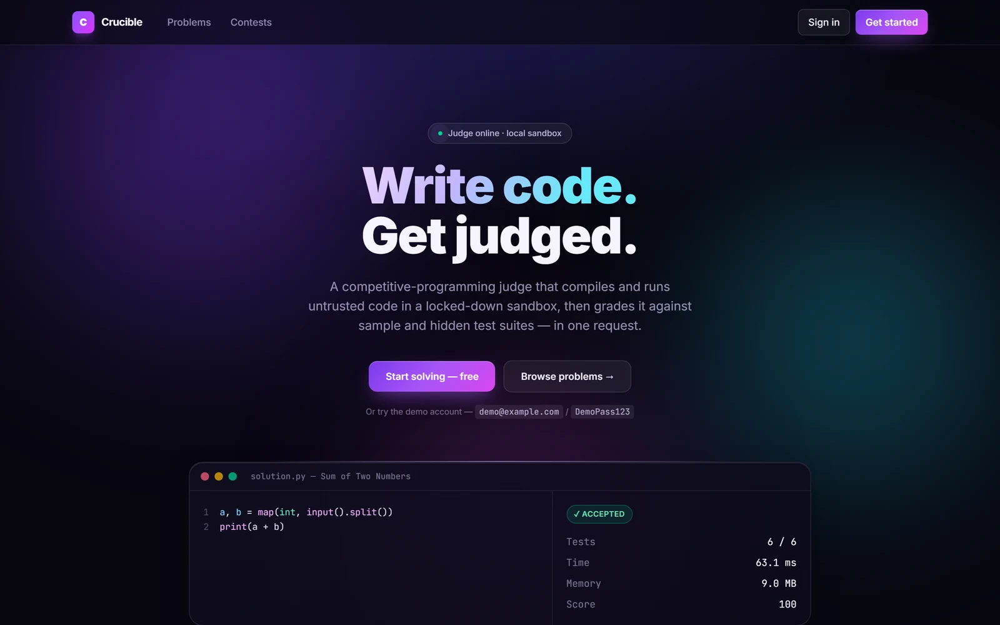

<div align="center">



# Crucible — Frontend

**React 19 · TypeScript · Vite · Tailwind CSS v4 · CodeMirror 6**

The single-page app for the [Crucible judge](../README.md).
**[Live →](https://crucible-web.onrender.com)**

</div>

---

- [Quick start](#quick-start)
- [Structure](#structure)
- [Design system](#design-system)
- [Making glassmorphism readable](#making-glassmorphism-readable)
- [Data layer](#data-layer)
- [Pages](#pages)
- [The editor](#the-editor)
- [Accessibility](#accessibility)
- [Performance](#performance)
- [Build and deploy](#build-and-deploy)

---

## Quick start

```bash
npm install
npm run dev          # http://localhost:5173
```

`.env.development` already points at `http://localhost:8000`, so with the API
running locally nothing needs configuring.

| Command | Does |
|---|---|
| `npm run dev` | Dev server with HMR |
| `npm run build` | Type-check (`tsc -b`) then build to `dist/` |
| `npm run preview` | Serve the production build locally |

### Configuration

One variable:

```env
VITE_API_BASE_URL=https://online-coding-judge-7w5q.onrender.com
```

No trailing slash, no `/api/v1` suffix — the client appends it.

> Vite **inlines** `VITE_*` at build time, so changing this needs a **rebuild**,
> not a restart. `.env.development` and `.env.production` are committed
> deliberately: these values end up in client JavaScript, so they are public by
> definition and cannot hold a secret. A public API URL is configuration.

---

## Structure

```
src/
├── lib/
│   ├── api.ts          Typed client — timeouts, 401 broadcast, error classes
│   ├── auth.tsx        Session context, restored and re-validated on boot
│   ├── types.ts        Mirrors the API's response shapes exactly
│   └── format.ts       Verdict tones, relative time, countdowns, memory
├── components/
│   ├── ui.tsx          Card · Button · Badge · VerdictBadge · Stat · EmptyState
│   ├── Layout.tsx      Shell, navigation, cold-start banner, footer
│   ├── CodeEditor.tsx  CodeMirror 6 with per-language modes and starters
│   └── Markdown.tsx    Safe minimal Markdown for problem statements
├── pages/
│   ├── Landing.tsx     Hero, live stats, features, honesty panel
│   ├── Auth.tsx        Login and register (one component, two modes)
│   ├── Problems.tsx    Catalogue with search, filters, pagination
│   ├── Solve.tsx       Statement + editor + verdict panel
│   ├── Contests.tsx    List with live countdowns
│   ├── ContestDetail.tsx  Problems and leaderboard
│   ├── Submissions.tsx History with verdict filters
│   ├── Dashboard.tsx   Analytics
│   └── NotFound.tsx
├── App.tsx             Routing, auth gate, lazy editor chunk
├── main.tsx
└── index.css           Design tokens, aurora field, glass system
```

State is deliberately plain: one context for the session, `useState` +
`useEffect` per page. There is no global store because there is no shared
mutable state that would benefit from one — each page owns its own fetch.

---

## Design system

Everything lives in [`src/index.css`](src/index.css) as Tailwind v4 `@theme`
tokens, so the palette sits beside the primitives that consume it.

### Tokens

```css
--color-canvas:          #07060f;   /* deep indigo-black, not pure black */
--color-aurora-violet:   #7c3aed;
--color-aurora-fuchsia:  #d946ef;
--color-aurora-cyan:     #22d3ee;
--color-accent:          #a78bfa;

--color-verdict-pass:    #34d399;
--color-verdict-fail:    #fb7185;
--color-verdict-warn:    #fbbf24;
--color-verdict-info:    #38bdf8;
```

The canvas is deliberately *not* pure black — the aurora needs something to
bleed into, and the glass needs a colour to pick up.

### The aurora field

Three radial blobs drifting on 26–38 s cycles behind a grain layer, in a fixed
non-interactive layer so no scroll or hover work is triggered.

```css
.aurora-blob { filter: blur(90px); will-change: transform; }
```

The grain matters: large flat gradients **band visibly** on 8-bit displays. An
SVG `feTurbulence` overlay at low opacity breaks the banding up.

### Primitives

| Class | Use |
|---|---|
| `.glass` | Translucent surface — cards, stats, nav |
| `.glass-solid` | Denser variant for body copy and code, where legibility outranks translucency |
| `.glass-hover` | Lift, border brighten, glow on hover |
| `.glass-edge` | Hairline gradient along the top edge — the "lit from above" detail |
| `.btn-primary` / `.btn-ghost` | Buttons |
| `.field` | Inputs with a focus ring |
| `.skeleton` | Shimmering loading placeholder |

---

## Making glassmorphism readable

The defining failure of this style is unreadable text. Four decisions prevent it:

**1 — Every surface keeps a solid base tint under the blur.** Contrast never
depends on whatever happens to drift behind it:

```css
.glass-solid {
  background: linear-gradient(160deg, rgb(18 15 34 / 0.88), rgb(12 10 26 / 0.92));
  backdrop-filter: blur(24px) saturate(150%);
}
```

**2 — Two tiers, chosen by content.** Decorative cards use `.glass`; anything
holding a paragraph or code uses `.glass-solid`.

**3 — A fallback for browsers without `backdrop-filter`.** Without it the cards
would render as barely-visible washes:

```css
@supports not ((backdrop-filter: blur(1px)) or (-webkit-backdrop-filter: blur(1px))) {
  .glass, .glass-solid { background: rgb(16 13 32 / 0.94); }
}
```

**4 — Inset highlights instead of flat borders.** A 1px top inset highlight and
a dark bottom inset give the edge-lit look real glass has, rather than a
rectangle with a stroke.

### Motion

Everything decorative is disabled under `prefers-reduced-motion`, including the
drifting aurora. The interface stays fully usable.

```css
@media (prefers-reduced-motion: reduce) {
  *, *::before, *::after {
    animation-duration: 0.01ms !important;
    transition-duration: 0.01ms !important;
  }
  .aurora-blob { animation: none; }
}
```

---

## Data layer

### The client

[`src/lib/api.ts`](src/lib/api.ts) is one `request()` wrapper plus a typed
surface. Four things it handles that a bare `fetch` would not:

**Timeouts.** Every request carries an `AbortController`. Judging gets 120 s
because it is synchronous and bounded by `tests × time_limit`; reads get 30 s;
the boot ping gets 90 s to survive a cold start.

**401 broadcast.** Any 401 clears the token and dispatches
`crucible:unauthorised`, which the auth context listens for — so an expired
token clears the UI immediately rather than on the next navigation.

**Typed errors.** `ApiError` carries the status and flattened field errors;
`NetworkError` distinguishes "never reached the server" from "server said no",
which the UI phrases differently.

**Field errors.** The API returns `{field, message}` pairs, so the auth form
renders each message beside its input rather than as one opaque banner.

### Session

[`src/lib/auth.tsx`](src/lib/auth.tsx) restores a stored token on boot and
**validates it against the server** rather than trusting it — a token may have
expired while the tab was closed.

### Cold-start handling

The API sleeps on free hosting. The app pings on boot and shows a "waking the
judge…" banner **only if the response is slow** (1.8 s threshold). A warm API
answers in well under a second and the user never sees it.

That turns the platform's weakness into a moment of explanation instead of an
app that looks broken.

---

## Pages

| Route | Auth | What it does |
|---|---|---|
| `/` | 🌐 | Hero, live judge status from `/health`, features, honest sandbox panel |
| `/login`, `/register` | 🌐 | One component, two modes; demo-account shortcut |
| `/problems` | 🌐 | Search, difficulty filter, pagination, solved markers |
| `/problems/:slug` | 🌐 | Statement + editor + verdict. Submitting needs a token |
| `/contests` | 🌐 | Live countdowns, ticking every second |
| `/contests/:id` | 🌐 | Problems (sealed until start) and leaderboard |
| `/submissions` | 🔑 | History with verdict filters |
| `/dashboard` | 🔑 | Analytics |

`RequireAuth` remembers where the user was headed and returns them there after
sign-in.

### The verdict panel

The most detailed piece of UI. On submit it shows the verdict badge, the failing
test index, four metrics, a progress bar across the suite, compiler or runtime
diagnostics, and a per-test breakdown.

**Sample cases show a full expected-vs-actual diff. Hidden cases show only an
index and timings** — because the API never sends their data, matching the
server-side guarantee exactly.

### Dashboard charts

Deliberately **not** red/green. Running the natural encoding through a
colour-blindness check, emerald and rose separate by **ΔE 4.6 under
deuteranopia** — well under the ΔE 8 threshold. Roughly 1 in 12 men could not
tell those bars apart.

So bars use **one hue for magnitude**, which is the job a bar chart actually
does, and identity comes from the label and verdict badge beside each bar.
Verdict badges elsewhere keep semantic colour but always carry a glyph
(`✓`, `✕`, `◴`) and the full verdict text, so colour is never the only signal.

---

## The editor

CodeMirror 6 via `@uiw/react-codemirror`, with `@codemirror/lang-python`,
`-cpp` and `-java`.

**Why not Monaco?** `@monaco-editor/react` loads Monaco from a CDN by default,
so the editor breaks on any network that blocks it. CodeMirror bundles cleanly
with Vite and is roughly a third of the size.

**Drafts persist** to `localStorage` keyed by problem **and** language, so
switching languages or navigating away never loses work:

```ts
const draftKey = (slug: string, language: string) =>
  `crucible.draft.${slug}.${language}`;
```

Each language ships a runnable starter, so a new user is never staring at an
empty buffer.

---

## Accessibility

- Semantic landmarks — `<header>`, `<main>`, `<nav>`, `<footer>`
- Every control labelled; icon-only buttons carry `aria-label`
- Filter groups use `role="group"` with `aria-pressed`
- Progress meters use `role="meter"` with min/now/max
- A visible focus ring on every interactive element
- `aria-invalid` and `aria-describedby` wire form errors to their inputs
- Decorative glyphs are `aria-hidden`
- Colour is never the sole signal — verdicts always pair hue with a glyph and text
- `prefers-reduced-motion` respected throughout

---

## Performance

```
dist/assets/index.css      52.8 kB │ gzip:  10.0 kB
dist/assets/index.js      238.4 kB │ gzip:  71.4 kB
dist/assets/router.js      38.5 kB │ gzip:  13.8 kB
dist/assets/Solve.js       14.5 kB │ gzip:   4.4 kB
dist/assets/editor.js     620.6 kB │ gzip: 210.1 kB   ← lazy
```

The editor is two thirds of the bundle and is only needed once someone opens a
problem, so `/problems/:slug` is lazy-loaded behind `React.lazy`. A first-time
visitor loads roughly **95 kB gzipped**, not 300.

Other choices: content-hashed filenames cached `immutable` for a year, no
runtime CSS-in-JS, no icon library (glyphs are Unicode), no chart library (bars
are divs).

---

## Build and deploy

```bash
npm run build     # tsc -b && vite build → dist/
```

Deployed as a **Render static site** — free, CDN-served, never sleeps. Defined
in [`render.yaml`](../render.yaml) as the `crucible-web` service:

```yaml
runtime: static
rootDir: frontend
buildCommand: npm ci && npm run build
staticPublishPath: ./dist
routes:
  - type: rewrite
    source: /*
    destination: /index.html
```

That rewrite is required. Without it a hard refresh on `/problems/two-sum`
returns 404 — the static host looks for a file at that path, while routing
actually happens in the browser.

📖 **[Full deployment guide →](../docs/DEPLOYMENT.md)**
